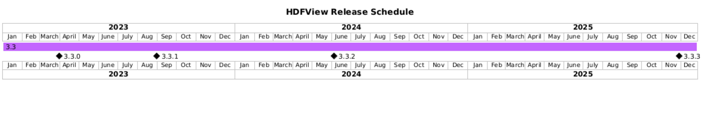

## Build Status

[](https://github.com/HDFGroup/hdfview/actions/workflows/maven-ci-orchestrator.yml)
[](https://github.com/HDFGroup/hdfview/actions/workflows/ci-linux.yml)
[](https://github.com/HDFGroup/hdfview/actions/workflows/ci-windows.yml)
[](https://github.com/HDFGroup/hdfview/actions/workflows/ci-macos.yml)

[](https://github.com/HDFGroup/hdfview/actions/workflows/maven-quality.yml)
[](https://github.com/HDFGroup/hdfview/actions/workflows/maven-security.yml)

## Custom fork / Windows development

The following commands describe the Windows workflow for this custom fork. Run them from the repository root (`D:\Git\HDFView-custom` in the local setup used for verification).

### Prerequisites

- JDK 21 or later. The Maven compiler configuration targets Java 21.
- Maven 3.6 or later is needed for source builds and `run-hdfview.bat --maven`; the verified local Maven version is 3.9.16. The default direct-JAR launcher and `--validate` do not require Maven.
- HDF5 2.2.0 native libraries are required. HDF4 4.4.0 libraries are optional unless HDF4 files are needed. Configure the local `build.properties` entries `hdf5.lib.dir`, `hdf5.plugin.dir`, `hdf.lib.dir`, and the Windows semicolon-separated `platform.hdf.lib` DLL path. Keep absolute machine paths in local configuration; do not commit them.
- Windows SWT is selected by the Maven profile as `org.eclipse.swt.win32.win32.x86_64` version 3.126.0. SWTBot tests need a real Windows desktop/display and the configured native libraries.

`build.properties` is the Maven user-properties input, not a portable native-library bundle. Set its paths for the local machine before building. A packaged app-image or installer contains its own jpackage runtime; end users do not need Maven or a separate JDK, but source development still requires JDK 21+.

### Build

Use the reactor build when compiling the object dependency and HDFView together:

```powershell
mvn -pl hdfview -am compile -B
mvn -pl hdfview -am package -DskipTests -B
```

The first command is a fast compile check. The second creates the direct-launch artifact `libs\hdfview-99.99.99.jar` and runtime dependencies under `hdfview\target\lib` without running tests.

### Run

`run-hdfview.bat` launches an already-built artifact; it does not compile automatically. Its default direct-JAR mode only needs Java, the configured native libraries, `libs\hdfview-*.jar`, and `hdfview\target\lib`:

```powershell
.\run-hdfview.bat
.\run-hdfview.bat --debug
.\run-hdfview.bat --validate
.\run-hdfview.bat --maven
.\run-hdfview.bat --choose
```

`--debug` selects the existing SLF4J simple logger. `--validate` checks Java major version 21+, native-library configuration, and direct-JAR runtime artifacts; it does not run Maven or a build. `--maven` checks Maven only for that mode and uses the existing `mvn exec:java -Dexec.mainClass="hdf.view.HDFView" -pl hdfview` launch path. Use the build commands above when the artifact is not present.

### Test

The focused inline Dataset UI regression suite can be run with:

```powershell
mvn -pl hdfview -Dtest=TestHDFViewInlineDataset test -B
```

For the complete HDFView module test suite, use:

```powershell
mvn -pl hdfview test -B
```

These are SWTBot tests rather than headless tests, so run them on an interactive Windows desktop with HDF5/HDF4 native paths configured. The focused command completed successfully in the verified environment. The complete suite currently includes unrelated baseline failures in the long-double complex dataset checks; do not interpret a full-suite failure as a successful build.

### Package / pack

The Windows portable app-image uses both profiles named by the HDFView POM. The current staging step invokes `ls` to list its input, so Git for Windows `usr\bin` must be on `PATH` if `ls` is not already available:

```powershell
# Only needed when `Get-Command ls` cannot find the Git for Windows tool.
$env:Path = "C:\Program Files\Git\usr\bin;$env:Path"
mvn -pl object,hdfview -am verify -Pjpackage-app-image,jpackage-win-base -DskipTests -B
```

The verified app-image is the directory `hdfview\target\dist\HDFView`, with launcher `hdfview\target\dist\HDFView\HDFView.exe` and bundled `runtime` directory. It is portable and already contains a jpackage runtime.
The app-image also carries the SWT Windows native libraries under `app\native` and the HDF5/HDF4 native runtime DLLs beside the launcher, so starting `HDFView.exe` from this directory does not depend on the source checkout's native-library paths.

When `run-hdfview.bat` is started by double-click and a validation or launch step fails, it keeps the console open and waits for a key so the real error remains visible. Set `HDFVIEW_NO_PAUSE=1` when invoking it from automation or another console and a failure returns a non-zero exit code without waiting.

Generate the Windows MSI only after the app-image exists:

```powershell
mvn -pl hdfview package -Pjpackage-installer-windows -Djpackage.type=msi -DskipTests -B
```

The MSI destination is `hdfview\target\dist`; with the current `VERSION` (`99.99.99`), jpackage names the successful package `HDFView-99.99.99.msi`. This checkout did not produce that file because WiX `candle.exe` and `light.exe` are not installed/available on `PATH`; install/configure WiX before treating the MSI command as successful.

The Windows installer profile registers the repository's existing `.h4`, `.hdf`, `.hdf4`, `.h5`, and `.hdf5` file associations and creates a Start Menu entry under `The HDF Group`. It currently has no `--win-shortcut` option, so no desktop shortcut is configured.

The HDF Group is the developer, maintainer, and steward of HDFView. Find more
information about The HDF Group, the HDFView Community, and other HDF software projects,
tools, and services at [The HDF Group's website](https://www.hdfgroup.org/). 


HELP AND SUPPORT
----------------
Information regarding Help Desk and Support services is available at

   https://help.hdfgroup.org/


FORUM and NEWS
--------------
The [HDF Forum](https://forum.hdfgroup.org) is provided for public announcements and discussions
of interest to the general HDFView Community.

   - News and Announcements
   https://forum.hdfgroup.org/c/news-and-announcements-from-the-hdf-group

   - HDFView (and Java) Topics
   https://forum.hdfgroup.org/c/hdfview-java-hdf-object-package

These forums are provided as an open and public service for searching and reading.
Posting requires completing a simple registration and allows one to join in the
conversation.  Please read the [instructions](https://forum.hdfgroup.org/t/quickstart-guide-welcome-to-the-new-hdf-forum
) pertaining to the Forum's use and configuration.

RELEASE SCHEDULE
----------------

 

HDFView releases about once a year, following the most recent HDF5 and HDF4 releases.
Future HDFView releases indicated on this schedule are tentative.

**NOTE**: All HDFView releases are now based on the latest maintenance releases
of HDF5 and HDF4. Previous releases of HDFView that were based on HDF5 1.8,
1.10, and 1.12 (e.g. 3.1.x, 3.2.x) have been retired.

| Release | HDF5 | HDF4 | New Features |
| ------- | ---- | ---- | ------------ |
| 3.3.0 | 1.14.0 | 4.2.16 | HDF5 1.12 (new-style) references, Single-Writer/Multiple-Readers (SWMR) reads, bug fixes |
| 3.3.1 | 1.14.2 | 4.2.16-2 | Fixes a critical HDF4 + HDFView bug |
| 3.3.2 | 1.14.4 | 4.3.0 | Float16 support |
| 3.4.0 | 2.0.0 | 4.3.1 | Complex number support |


PREVIOUS RELEASES AND SOURCE CODE
--------------------------------------------
Source packages for current and previous releases are located at:
    
   https://support.hdfgroup.org/downloads/

Development code is available at our Github location:
    
   https://github.com/HDFGroup/hdfview.git
